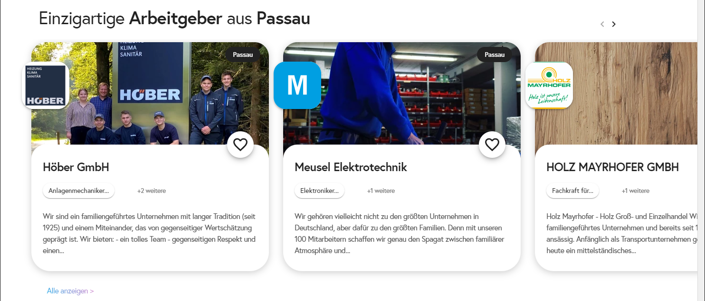
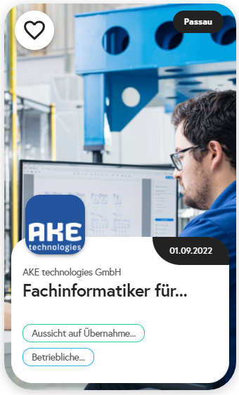
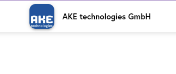

# Onboarding Task

## Prerequisites

We ask you to clone this project.
It contains of a default Nuxt.js project including

- Axios for API calls,
- Vuetify as component library
- Vuex for state management
- EsLint & Prettier as formatters
- and some CSS from our designs.

## Task Description

Your task is about the re-creation of existing components.
To be precise: The businesses and their representation in a preview-list on our page. This can be visible on e.g. [Oabat Passau](https://www.oabat.de/a/passau-2855328)

It consists of (at least) 3 components. More are possible if you feel the need for it.

- **BusinessList** (A horizontal & scrollable list of the businesses)
  - Should fill the full with of the page and allows scrolling on the horizontal axis.
  - Does not require any mobile-swiping or dragging logic. A simple scrollbar is sufficient.
  - Should have a headline above the list (`Einzigartige [TYPE] aus [CITY]`)
  - Can contain different types of Cards. E.g. `ApprenticeshipCards, TraineeshipCards,...`. But the implementation of these additional is not part of this.
- **BusinessCard** (The cards themselfs)
  - Displays a company based on the example data below.
  - CAN contain multiple tags (e.g. `Beton- und...` on the first card). But only display the first tag (truncated if necessary) and the rest is not displayed but previewed as "`+[N] weitere`"
  - A `like` button that is toggled on click. The changed like-state should be updated in the associated object in a Vuex-Store.
  - Includes description, title, preview-image and the BusinessLogo.
- **BusinessLogo** (The Logo on the top left of every BusinessCard)
  - A very lightweight component that displays the business' logo.
  - It has several occurrences in different layouts that need to be considered (see "Example BusinessLogo 2")
    - Serves as a general wrapper for BusinessLogos and should deal with the general design of it, so business-logos are viewed consistent throughout the page
    - Should have a fallback to display if the image is not available.

We have a major fokus on thought-through **properties**, **emits**, **non-redundant** data storage and **reusable, readable components**.

The appended images are taken from the current online website and represent the "mockup" to this task. Feel free to visit the original component at [Oabat](https://www.oabat.de/a/passau-2855328)

## Project Description

In the Vuex-store is an dummy `businesses` array. You should use it and not change the data of it. There is no need to handle any API calls to fetch or update the business-array.
Handle every store-interaction using suitable getter(s), setter(s) as well as mutation(s) & action(s).

The additional CSS from us is in the `/assets` directory and should be used whenever possible or oabat-related design is used

The components can be implemented directly on the index page and do not require any further design.

## Build Setup

```bash
# install dependencies
$ npm install

# serve with hot reload at localhost:3000
$ npm run dev
```

For detailed explanation on how things work, check out [Nuxt.js docs](https://nuxtjs.org).

# Attachment

| Mockup                             | BusinessLogo Example usage                                                                                       |
| ---------------------------------- | ---------------------------------------------------------------------------------------------------------------- |
|  | In different card versions  In a toolbar (smaller version) |
|                                    |
